# Methods

Joined data to gather overall information about the card users, their cards and their respective transactions with their cards using INNER join

Separated dataset to two types: fraud and non-fraud, for easier analysis and comparison

Analysed age distribution overall for fraud and non-fraud transactions

Analysed amount spent for fraud transactions for possible high amounts of large amounts transacted, and compared expenditure to non-fraud transactions

Analysed multiple univariate data for potential dominance of unique values
- **card_type**
- **card_brand**
- **use_chip** (may be misappropriately labelled but we roll)
- **mcc_description** (used OUTER join)
- **has_chip**

Dropped repeated transactions where values are equal but their signage are different, presumably because the transactions were refunded or voided

Analysed times when fraudulent transactions occured

Balanced dataset between fraudulent and non-fraudulent datasets with stratified sampling while maintaining proportions from original datasets

# Analysis

Three unique card types, and the proportionality between two datasets are surprisingly the same. Datasets are reduced to unique card_id values to prevent over-counting of the same cards. For machine learning models, this variable will not be used as it does not show any signs of differences that give rise to suspicions of fraud.

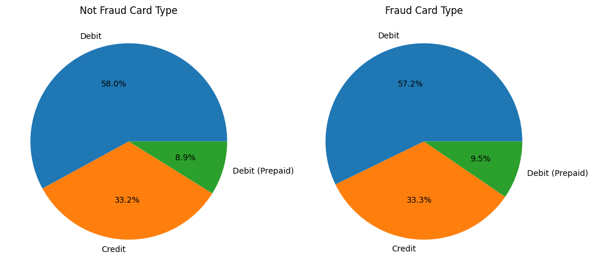

Four unique card brands, and proportionality between the datasets is surprisingly the same again. Datasets are also reduced to unique card_id values for the same reason. This variable will also not be used as a feature for machine learning models.

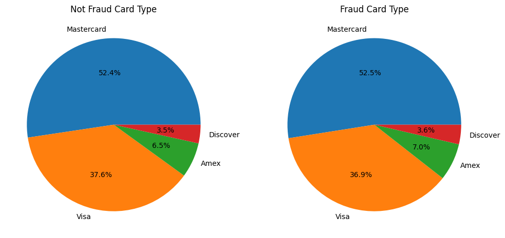

Three unique chip uses. There is a clear distinct proportionalities for both datasets. In the fraud dataset, majority of fraudulent activities are done via online transactions while non-fraudulent activities were performed by swiping their cards. Thus, this sort of separation is significant enough to be a feature for machine learning models to detect possible fraud activities.

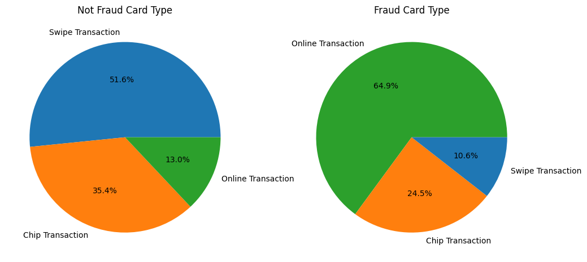

MCC descriptions, showing where the money has gone to, are reduced to show only the top 5 most frequent counts as there is a total of 108 unique values. Again, there are clear distinctions as to where the money was spent on. On the fraudulent dataset, many of the transactions were spent at Department Stores and little on Drug Stores and Pharmacies while the opposite is true for the non-fraudulent dataset. 

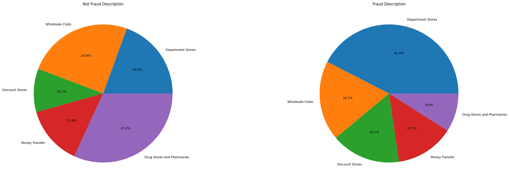

Looking a little deeper if age has anything to do with the differing interests, the age distributions for all five MCCs are very similar yet again, despite alot of noise, which is a surprising find. Therefore, age does not matter and would not affect machine learning models in any meaningful way.

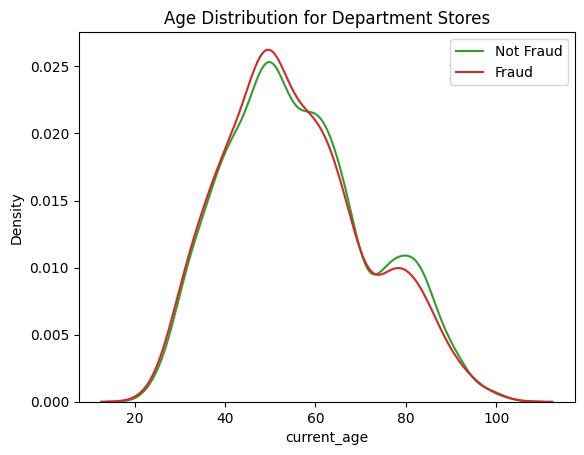

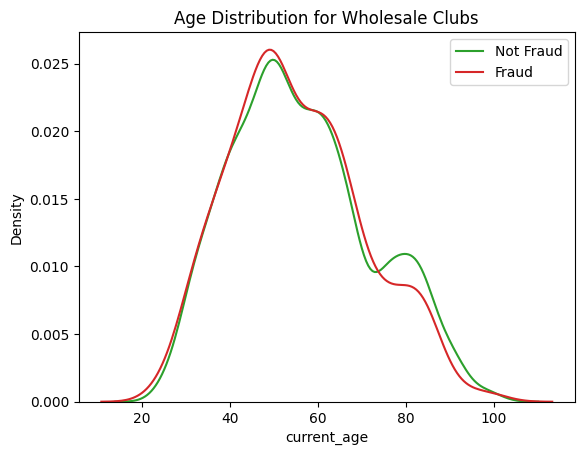

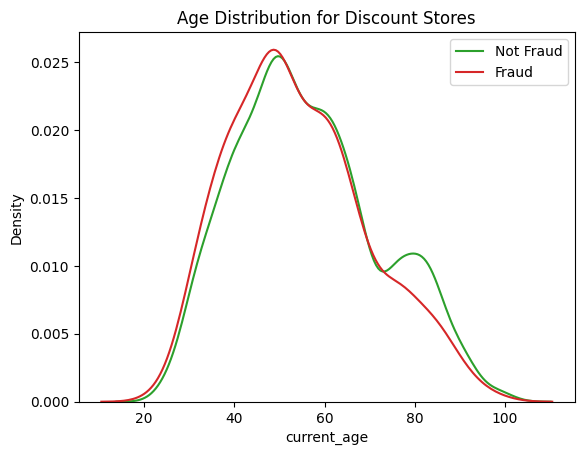

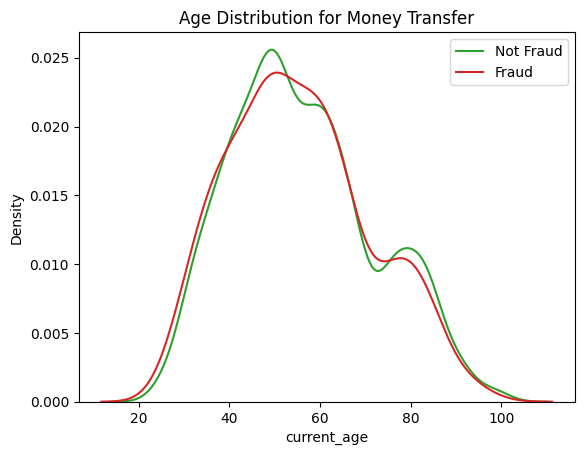


The chips in cards are mostly present for both datasets, and they have the same proportionality. This will not be used as features in machine learning models.

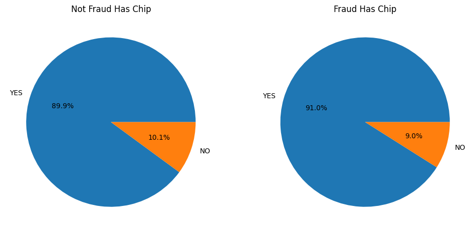

For merchants in both datasets, it is seen that both have online merchants, but it is noticeable that in the non-fraudulent dataset, the next most frequent counts of merchants are local while the fraud dataset contains some merchants from overseas, notably from Rome, Italy and Port au Prince, Haiti. Thus, while the proportions differ, the fact that there are higher counts of overseas merchants than local ones in fraud dataset cannot be overlooked. Thus, this feature is considered as a feature for machine learning models.

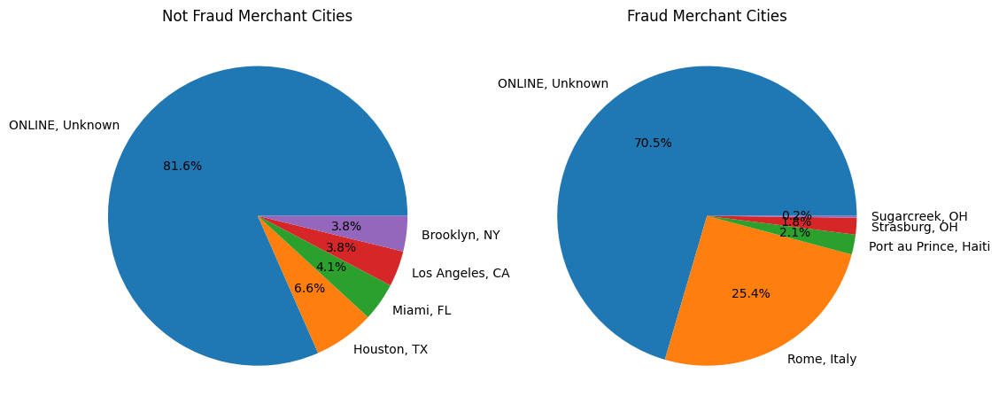

The times when transactions happened for both datasets, while the counts differ due to uneven sample size and slight noise in the datasets are present for both, are almost identical. Note that the graph shows the hour in which the transactions took place. In addition, the counts of transaction days are also identical throughout the week. Thus, when the transactions happened would not show much impact on the machine learning models, hence they are omitted as features.

# Machine Learning Data Preprocessing

Firstly, all 34 unnecessary columns are dropped before preprocessing, leaving with only 5 columns. Then, the sampling is stratified for the non-fraudulent dataset to match the number of data on fraudulent dataset while maintaining the proportionality represented in the original non-fraudulent dataset. This method will make sure that random data is not selected with biased variables which are not representative of original non-fraudulent dataset. For reference, the fraudulent dataset contains 12679 records while non-fraudulent dataset contains 7.9 million. Thus, for fair analysis for machine learing models, the non-fraudulent records are reduced in a sample dataset. 

Combining the datasets now yields 25358 records with equal target distribution and 5 remaining columns with 4 of them as predictor variables for machine learning models. The predictive variables are 'mcc_description', 'amount', 'use_chip' and 'merchant_city_state'. Target variable is 'target', containing binary values with 'Yes' and 'No'. The categorical variables have been encoded and dataset is normalized with Min-Max scaler.

# Machine Learning Models Results

The base machine learning model used is Scikit-Learn's LogisticRegression model and the supporting models are DecisionTreeClassifier and RandomForestClassifier. As seen in the results, the models have performed similarly, being able to distinguish between fraudulent and non-fraudulent transactions very confidently. The precision and recall scores are near perfect at 96%. 

```
# Logistic Regression model

              precision    recall  f1-score   support

          No       0.97      0.93      0.95      4212
         Yes       0.93      0.97      0.95      4157

    accuracy                           0.95      8369
   macro avg       0.95      0.95      0.95      8369
weighted avg       0.95      0.95      0.95      8369


# Decision Tree Classifier model

              precision    recall  f1-score   support

          No       0.95      0.96      0.96      4188
         Yes       0.96      0.95      0.96      4181

    accuracy                           0.96      8369
   macro avg       0.96      0.96      0.96      8369
weighted avg       0.96      0.96      0.96      8369


# Random Forest Classifier model

              precision    recall  f1-score   support

          No       0.96      0.97      0.96      4188
         Yes       0.97      0.96      0.96      4181

    accuracy                           0.96      8369
   macro avg       0.96      0.96      0.96      8369
weighted avg       0.96      0.96      0.96      8369
```

Looking a little deeper after running RandomForestClassifier model, it appears that the 'merchant_city_state' is the most defining variable that determines the most if a transaction is fraudulent or not, followed by 'mcc_description'. This means that it is imperative that users be aware of which merchants they use to transact and see if the transaction destination matches with what they want to buy, considering that most of the card users are of elder age groups. 

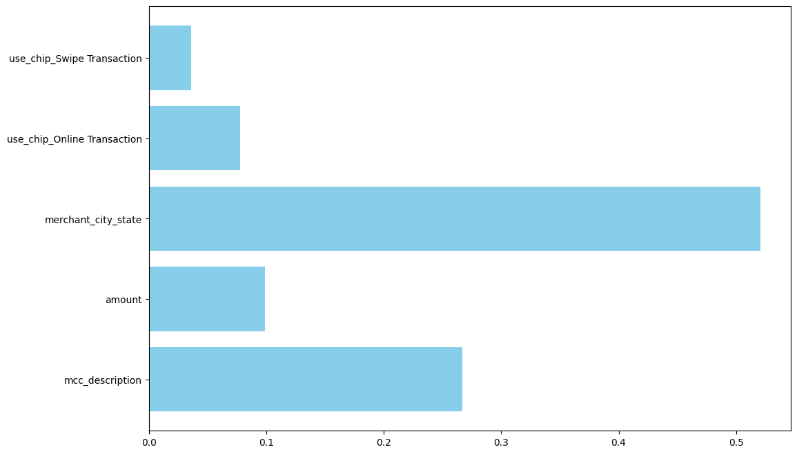